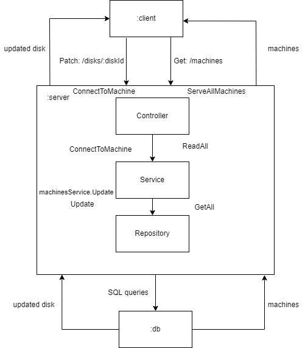

# rgr
Software Architecture - Calculation Graphic Work

## Лабораторна 3
Діаграмма взаємодії:

- `Get: /machines` Отримати список усіх машин
- `Patch: /disks/:diskId` Підключити певний диск до певної машини

У ролі клієнта виступає `http-запит` по будь-якому з двох доступних роутів: `Get: /machines` або `Patch: /disks/:diskId`.
Контроллер (`ServeAllMachines`, `ConnectToMachine`) відповідає за обробку http-запиту, викликає методи сервісу (`ReadAll`, `ConnectToMachine`), який в свою чергу викликає або методи репозиторію (`GetAll,` `Update`) або методи інших сервісів (сервіс `disksService` викликає метод `Update` сервісу `machinesService`). Методи репозиторію виконують `SQL-запити` до бази даних за допомогою прослойки з інтерфейсу бази даних. У результаті запиту база даних оновлюється і повертаються потрібні дані, які піднімаючись в зворотньому напрямку по схемі віддаются контроллером у вигляді `http-response`.

