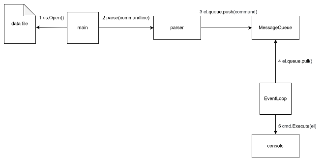

# RGR 

Software Architecture - Calculation Graphic Work

## Лабораторна 2

#### Вихідний код бенчмарку:

```go
package lab2

import (
	"fmt"
	"testing"
)

var operators = []string{
	"+",
	"-",
	"*",
	"/",
}

type BenchmarkCase struct {
	operands   []int
	expression string
}

func BuildBenchmarkCase(count int) *BenchmarkCase {
	operands := []int{}
	expression := ""
	n := count * count * count * count
	for i := 1; i <= n; i++ {
		operands = append(operands, i)
	}
	i := 0
	j := 0
	step := 2
	for i < len(operands) {
		expression += fmt.Sprint(operands[i])
		if i == len(operands)-1 {
			expression += " " + operators[j]
		} else if i != 0 && i%(step-1) == 0 {
			expression += " " + operators[j]
			j++
			if j == len(operators) {
				j = 0
			}
			step += 2
			if i%5 == 0 {
				step = 2
			}
		}
		if i != len(operands) {
			expression += " "
		}
		i++
	}
	return &BenchmarkCase{
		operands:   operands,
		expression: expression,
	}
}

func BenchmarkCalculatePostfix(b *testing.B) {
	cases := []*BenchmarkCase{}
	for i := 2; i <= 20; i++ {
		cases = append(cases, BuildBenchmarkCase(i))
	}
	for _, entry := range cases {
		title := fmt.Sprintf("operands=%d", len(entry.operands))
		b.Run(title, func(b *testing.B) {
			CalculatePostfix(entry.expression)
		})
	}
}
```

#### Результат бенчмарку:


#### Графік:


## Лабораторна 3

#### Діаграмма взаємодії:


- `Get: /machines` Отримати список усіх машин
- `Patch: /disks/:diskId` Підключити певний диск до певної машини

У ролі клієнта виступає `http-запит` по будь-якому з двох доступних роутів: `Get: /machines` або `Patch: /disks/:diskId`.
Контроллер (`ServeAllMachines`, `ConnectToMachine`) відповідає за обробку http-запиту, викликає методи сервісу (`ReadAll`, `ConnectToMachine`), який в свою чергу викликає або методи репозиторію (`GetAll,` `Update`) або методи інших сервісів (сервіс `disksService` викликає метод `Update` сервісу `machinesService`). Методи репозиторію виконують `SQL-запити` до бази даних за допомогою прослойки з інтерфейсу бази даних. У результаті запиту база даних оновлюється і повертаються потрібні дані, які піднімаючись в зворотньому напрямку по схемі віддаются контроллером у вигляді `http-response`.

## Лабораторна 4

#### Вихідний код бенчмарку:

```go
package parser

import (
	"testing"
	"fmt"
	
	"github.com/multipleton/sa-4/engine"
	"github.com/multipleton/sa-4/parser"
)

var cntRes engine.Command
func BenchmarkCount(b *testing.B) {
  const baseLen = 2000
  line := "print line\n"
  for i := 0; i < 14; i++ {
    l := baseLen * (i + 1)
    for k := 0; k < l; k++ {
      line = line + "print line \nsplit a-b-c -\n"
    }
    b.Run(fmt.Sprintf("len=%d", l), func(b *testing.B) {
      cntRes = parser.Parse(line)
    })  
  }
}
```

#### Результат бенчмарку:


#### Графік:


#### Діаграмма взаємодії:



На першому та другому кроці програма зчитує команди з файлу та парсить рядок за рядком. Отримані команди передаються 
у чергу повідомлень. Тим часом `EventLoop` дістає ці команди з черги та виконує їх. Результатом виконання команд є вивід
текстових даних у консоль.
